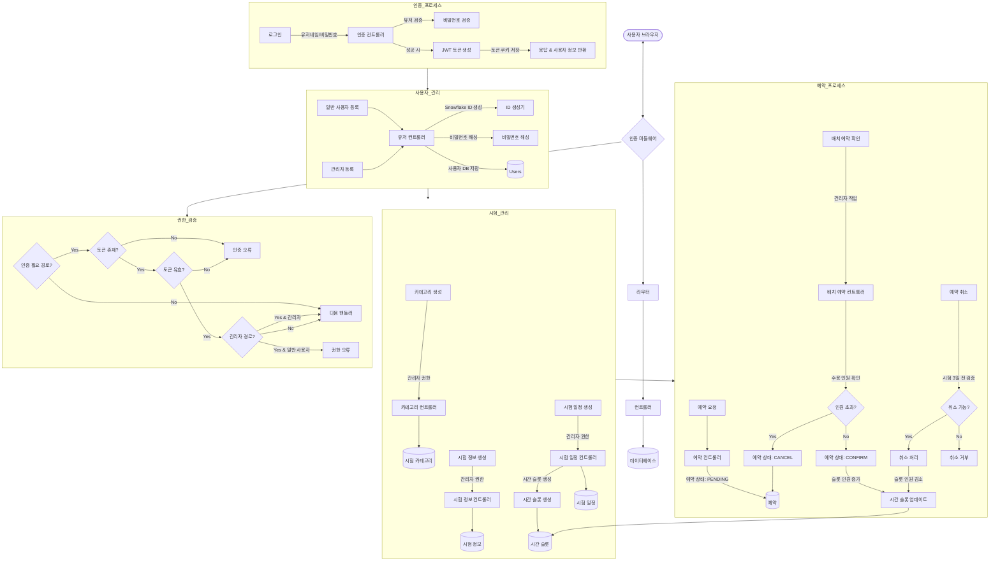
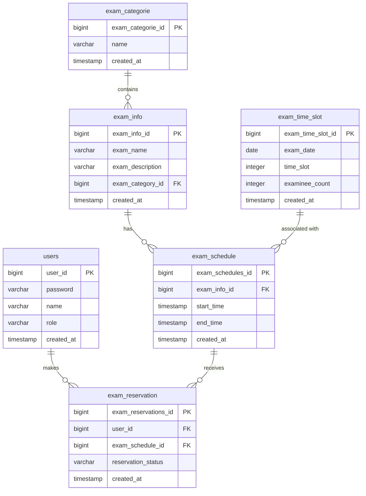

# 시험 예약 시스템 (Reservation System)

시험 예약 관리를 위한 REST API 기반 시스템입니다.

## 실행 방법

```bash
docker-compose up -d
```

## API 문서

서버 실행 후 다음 URL에서 Swagger UI를 통해 API 문서를 확인할 수 있습니다:

- http://localhost:8000/docs

## 시스템 요구 사항

- 동시간에 최대 5만명까지 예약 가능 (초과 불가)
- 한 사용자는 동시간대에 여러 개의 예약이 가능

## 시스템 아키텍처

### Flow Chart



### 데이터베이스 구조 (ERD)



## 시스템 설계 특징

### 사용자 권한 관리

- RBAC(Role-Based Access Control) 방식으로 `users` 테이블의 `role` 필드를 통해 USER와 ADMIN을 구분
- 관리자 전용 API 엔드포인트는 `/adm` 경로로 통일

### 시험 관리 구조

- 시험은 계층 구조로 설계:
  - 카테고리(exam_categorie) → 시험 정보(exam_info) → 시험 일정(exam_schedule)
- 각 카테고리는 여러 시험 정보를 포함할 수 있음
- 각 시험 정보는 여러 스케줄을 가질 수 있음

### 시간 슬롯 관리

- 시험 일정을 생성할 때 시작 시간과 종료 시간 사이의 시간 슬롯을 자동으로 생성
- 이미 존재하는 시간 슬롯은 중복 생성하지 않음
- 시간 슬롯은 독립적으로 관리되며, 특정 시험 일정에 종속되지 않음

### 예약 프로세스

- 사용자 예약 요청 시 최초 상태는 `PENDING`
- 관리자가 배치 처리를 통해 수용 인원을 확인하여 예약을 확정(`CONFIRM`) 또는 취소(`CANCEL`)
- 시험 시작 3일 전부터는 예약 취소 불가능

### 용량 관리

- 동시간대 최대 5만명까지 예약 가능
- 각 시간 슬롯의 `examinee_count` 필드를 통해 현재 인원 추적

## 기술 스택

- **백엔드**: FastAPI
- **데이터베이스**: PostgreSQL
- **인증**: JWT
- **배포**: Docker, Docker Compose
- **ID 생성**: Snowflake 알고리즘

## 개발자 정보

- GitHub: [https://github.com/fru1tworld/resavation-system](https://github.com/fru1tworld/resavation-system)

```

```
